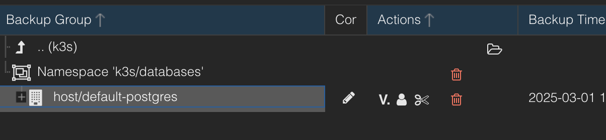
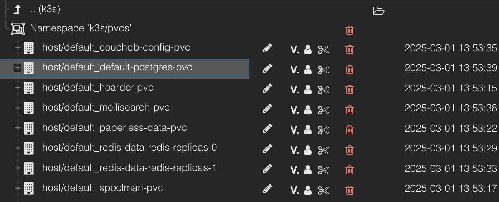

# PBS Kubernetes Backup

A docker image which can be used to backup Pvcs or a Postgresql to PBS. Telegram notification will be sent on failure.

## How to use

### Backup Postgres

> [!IMPORTANT]
> Check the required environment variables in the respective Bash script. They must be passed to the container e.g. via secret.

Following CronJob will dump the postgres to a temp dir, upload the content to PBS and deletes the backup from the temp dir. The script will write to `/backup`.

```yaml
---
apiVersion: batch/v1
kind: CronJob
metadata:
  name: default-postgres-backup
  namespace: default
spec:
  schedule: "0 23 * * *"
  jobTemplate:
    spec:
      template:
        spec:
          containers:
          - name: pbs-k8s-backup
            image: ghcr.io/fgeck/pbs-k8s-backup:latest
            env:
            - name: BACKUP_NAME
              value: "My-Postgresql"  
            envFrom:
            - secretRef:
                name: postgres-backup-secret
            volumeMounts:
            - name: temp-backup
              mountPath: /backup
            command: ["/entrypoint.sh", "postgres"]
          restartPolicy: never
          volumes:
          - name: temp-backup
            emptyDir:
              sizeLimit: 6Gi
```

Result:



### Backups PVCs

> [!IMPORTANT]
> Check the required environment variables in the respective Bash script. They must be passed to the container e.g. via secret.

Running my Kubernetes Cluster with K3s and local-path-provisioner I wanted a CronJob that backups all my dynamically provisioned PVCs to PBS.

The script will cd into `PVC_HOST_PATH` and back up all directories found there. When using local-path-provisioner this info can be found in the ConfigMap `local-path-config`.

A CronJob would look as follows:

```yaml
---
apiVersion: batch/v1
kind: CronJob
metadata:
  name: default-postgres-backup
  namespace: default
spec:
  schedule: "0 23 * * *"
  jobTemplate:
    spec:
      template:
        spec:
          containers:
          - name: pbs-k8s-backup
            image: ghcr.io/fgeck/pbs-k8s-backup:latest
            env:
            - name: PROXMOX_BACKUP_SERVER_NAMESPACE
              value: "k3s/pvcs"
            - name: PVC_HOST_PATH
              value: <PVC_HOST_PATH> # e.g. /opt/k3s/pvcs
            envFrom:
            - secretRef:
                name: postgres-backup-secret
            volumeMounts:
            - name: pvcs
              mountPath: /pvcs
            command: ["/entrypoint.sh", "pvcs"]
          restartPolicy: never
          volumes:
          - name: pvcs
            hostPath:
                path: <PVC_HOST_PATH> # e.g. /opt/k3s/pvcs
                type: Directory
```

Result:

